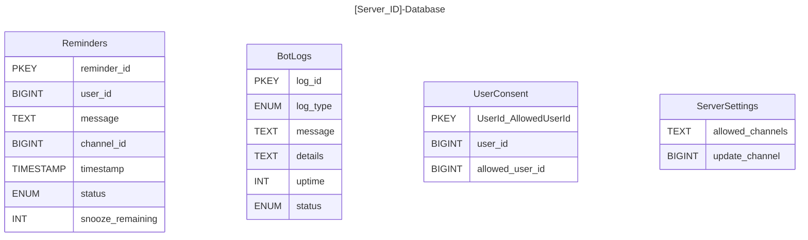

+++
title = 'Go Bot the Second'
date = 2025-02-26T15:50:21+01:00
draft = true
+++

```mermaid
---
title: "[Server_ID]-Database"
---
erDiagram

Reminders {
    PKEY        reminder_id
    BIGINT      user_id
    TEXT        message
    BIGINT      channel_id
    TIMESTAMP   timestamp
    ENUM        status
    INT         snooze_remaining
}

BotLogs{
    PKEY        log_id
    ENUM        log_type
    TEXT        message
    TEXT        details
    INT         uptime
    ENUM        status
}

UserConsent{
    PKEY        UserId_AllowedUserId
    BIGINT      user_id
    BIGINT      allowed_user_id
}

ServerSettings{
    TEXT        allowed_channels
    BIGINT      update_channel
}
```